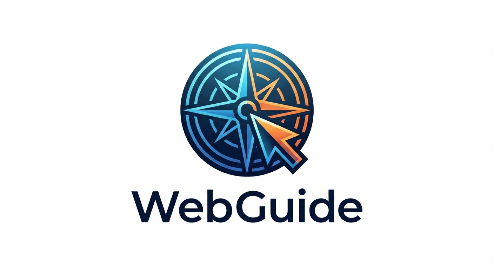

# WebGuide: Your AI Co-Pilot for the Web

**WebGuide** is a Chrome extension that helps you navigate any website and achieve your goals **without taking control away from you**.

## Philosophy: Guide, Don't Take Over

In the age of autonomous agents that try to click buttons for you, WebGuide takes a different approach. We believe that **you** are the best operator of your browser. The websites you use were designed for humans, and often the most intuitive way to fill out a form or select an option is to simply click it yourself.

WebGuide acts as an intelligent companion sitting next to you. It sees what you see, understands your goal, and provides:

- **Visual Cues**: Highlights exactly where to look.
- **Spoken Instructions**: Tells you naturally what to do next.
- **Step-by-Step Plans**: Breaks down complex tasks into manageable actions.

It doesn't try to be the captain; it's the navigator. You stay in the driver's seat.

## Key Features

- **👁️ Visual Understanding**: Uses **Gemini 3.0 Flash** to analyze your active tab. It understands layouts, menus, and context just like a human does.
- **📍 Contextual Guidance**: Tracks your progress across multiple pages. It knows when you've finished a step and automatically updates the plan.
- **🗣️ Natural Voice**: Speaks instructions to you, so you can keep your eyes on the page (with a convenient "Pause Agent" button when you need quiet).
- **⚡ User Agency**: You perform the actions. This ensures 100% accuracy and trust, especially for sensitive inputs like logins or payments.
- **🔒 Privacy-First Design**: All processing happens locally or directly via your browser. Extension sends requests **directly** to Google's Gemini API using the key you provide with no third-party in between.

## Getting Started

1.  **Install**: Load the extension in Chrome.
2.  **Open**: Click the extension icon to open the Side Panel.
3.  **Ask**: Type your goal (e.g., "How do I apply for this hackathon?" or "Help me find the pricing page").
4.  **Act**: Follow the spoken and visual guidance. The agent will track your progress and update automatically.

## Development

This project is built with [Plasmo](https://docs.plasmo.com/).

To run the development server:

```bash
cd extension
npm run dev
# or
pnpm dev
```

Open your browser and load the appropriate development build from `extension/build/chrome-mv3-dev`.

## Environment Configuration

Create a `.env` file in the `extension` directory (see `.env.example`).

```bash
PLASMO_PUBLIC_GEMINI_MODEL=gemini-3-flash-preview
PLASMO_PUBLIC_DEV_MODE=true
```

- **PLASMO_PUBLIC_GEMINI_MODEL**: The Gemini model to use for guidance.
- **PLASMO_PUBLIC_DEV_MODE**: Set to `true` to enable debug features (visual overlays test button, raw JSON response details). Set to `false` for a cleaner user experience.
